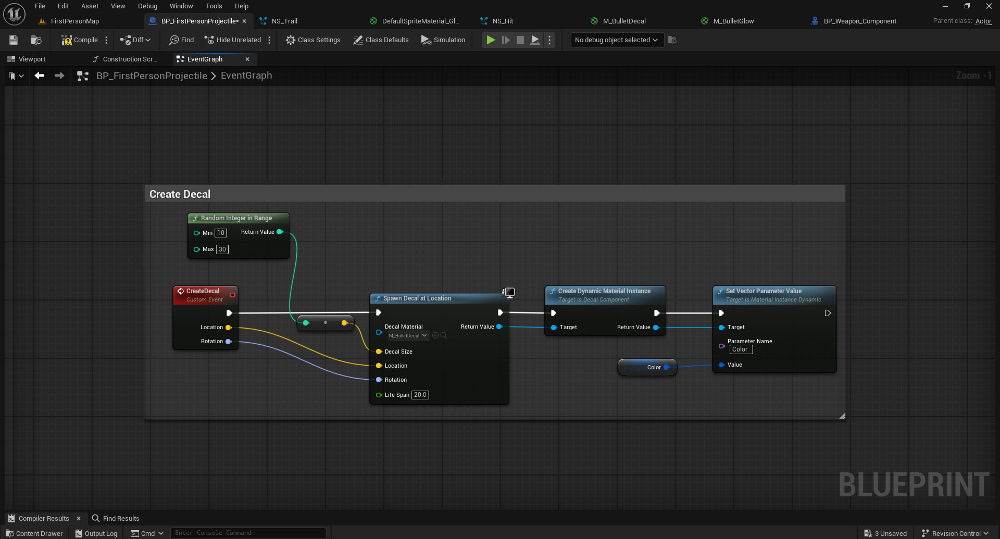

# Customizable Projectile FX System

A modular and fully customizable projectile visual effects demo built on top of the **Unreal Engine First Person Template (UE 5.5.4)**.  
Implemented 100% in **Blueprints**.

---

## What's Included

- **Glowing projectile material** with `GlowIntensity` and `Color` parameters  
  `/Game/FPWeapon/Materials/M_BulletGlow.uasset`
  
- **Niagara-compatible glowing sprite material** with `GlowIntensity` parameter  
  `/Game/FPWeapon/Materials/DefaultSpriteMaterial_Glow.DefaultSpriteMaterial_Glow`

- **Decal material** with dynamic `Color` parameter  
  `/Game/FPWeapon/Materials/M_BulletDecal.M_BulletDecal`

- **Projectile trail system** (`NS_Trail`) with user-exposed `Color` parameter  
  `/Game/VFX/NS_Trail.NS_Trail`

- **Impact FX system** (`NS_Hit`) with user-exposed `Color` parameter  
  `/Game/VFX/NS_Hit.NS_Hit`

- **Projectile Blueprint**  
  `/Game/FirstPerson/Blueprints/BP_FirstPersonProjectile`  
  Extended to include impact FX, decals, trail system, and a `Color` parameter that synchronizes all visual effects.

- **Weapon Component Blueprint**  
  `/Game/FirstPerson/Blueprints/BP_Weapon_Component`  
  Extended to support dynamic `Bullet Color` assignment and runtime color switching via hotkeys 1–7 (rainbow colors).

---

## How to Use

- Press **Left Mouse Button** to shoot
- Change projectile color in real-time using the following hotkeys:

| Key | Color       |
|-----|-------------|
| 1   | Red         |
| 2   | Orange      |
| 3   | Yellow      |
| 4   | Green       |
| 5   | Cyan / Light Blue |
| 6   | Blue        |
| 7   | Purple      |

---

## Technical Breakdown

### NS_Trail (Trail Particle System)

Based on Niagara's `Fountain` template.  

**Key modifications:**
- Exposed user parameter `Color`
- `Color Mode`: HSV random with `Hue Shift Range: -0.01 to +0.01`
- `Sprite Size`: 1 to 6
- `Spawn Rate`: 40
- `Velocity In Cone`: Min 50 – Max 85
- Sprite Material: `/Game/FPWeapon/Materials/DefaultSpriteMaterial_Glow`
- GPU Sim enabled, fixed bounds

**Integration:**

Component `NS_Trail` added under `CollisionComponent`.

---

### NS_Hit (Impact FX)

Based on Niagara's `OmnidirectionalBurst` preset.  

**Key modifications:**
- Exposed user parameter `Color`
- `Color Mode`: HSV random with `Hue Shift Range: -0.01 to +0.01`
- Sprite Material: `/Game/FPWeapon/Materials/DefaultSpriteMaterial_Glow`
- GPU Sim enabled, fixed bounds

**Integration:**

On collision, `Impact Point` is passed into `SpawnHitSystem`.  
A boolean flag `Destroy Actor` determines whether to destroy the projectile after the FX ends — based on ricochet logic (`HitCount >= MaxCount`).

If destruction is triggered: disable `CollisionComponent`, hide the mesh and the trail FX.

---

### M_BulletDecal (Impact Decal)

- **Material Domain**: `Deferred Decal`
- **Blend Mode**: `Translucent`
- **Base Color**: Vector parameter `Color`
- **Opacity**: Grunge/splatter texture (with alpha)

**Spawning decals:**

- Location: `Impact Point`
- Rotation: `Make Rotation From Axes` using `Impact Normal`, with random roll (0–350°)
- Size: Random Integer 10–30
- Lifespan: 20s  

---

### Color Synchronization

- Materials and Niagara FX receive a unified `Color` parameter
- A **Dynamic Material Instance** is created per projectile
- Color is defined in `/Game/FirstPerson/Blueprints/BP_FirstPersonProjectile`

- Color is passed from `/BP_Weapon_Component` during projectile spawn:

- Color change via keyboard input is handled in Weapon Component:

---

## Created by

**Aida Drogan**, Lead Developer at [SilverCord-VR](https://silvercord-vr.com/)    
We’re open to collaboration and game development partnerships!